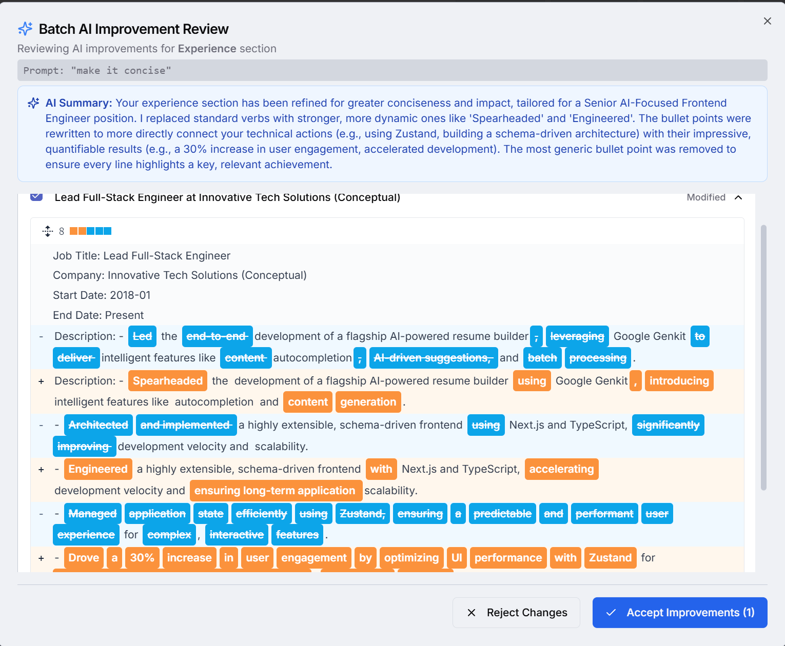
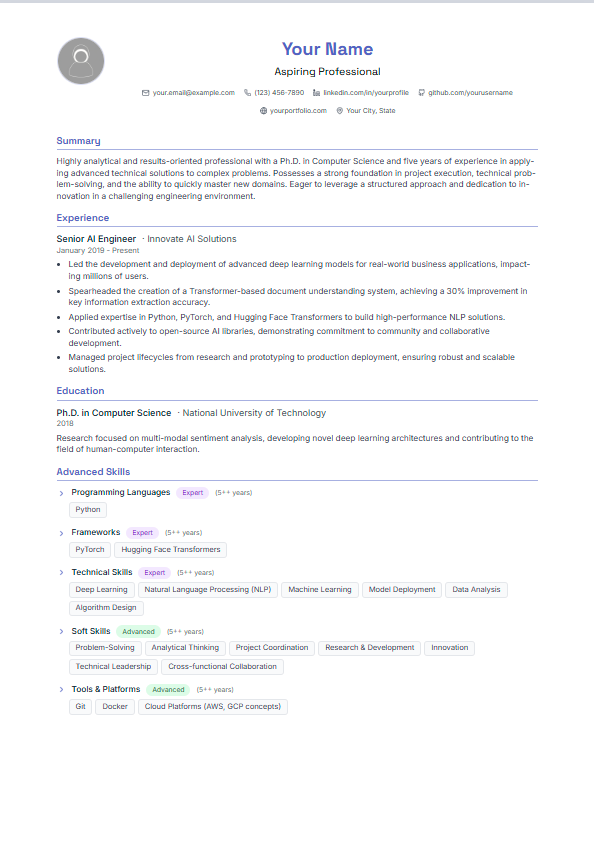
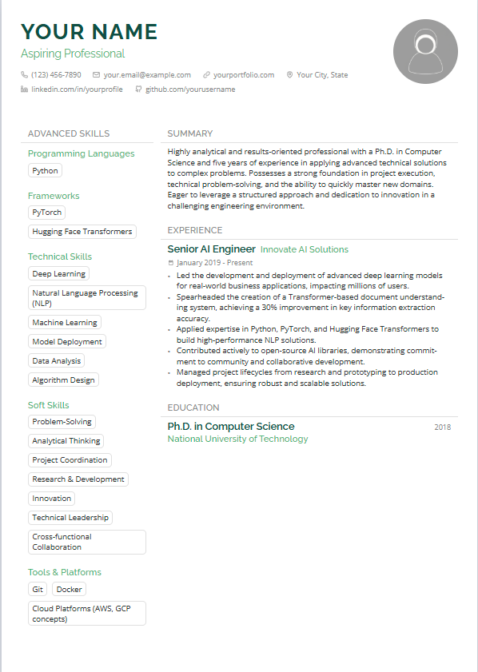
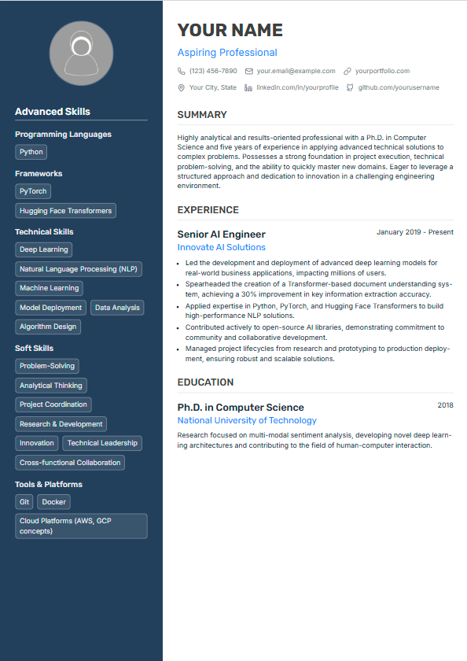
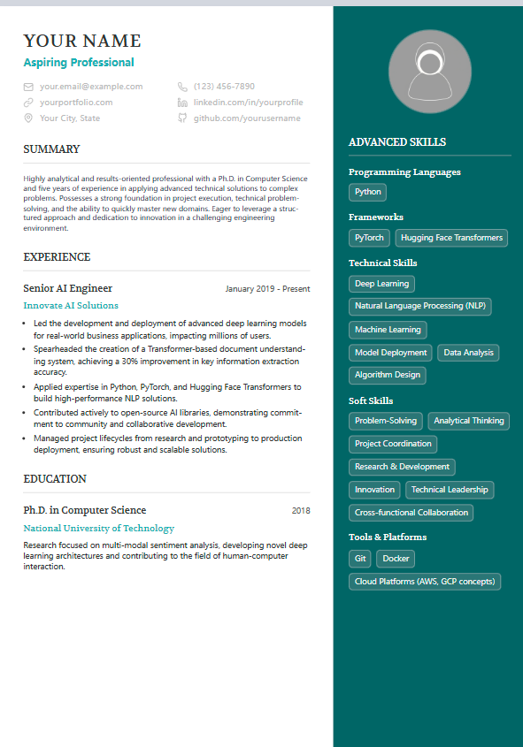
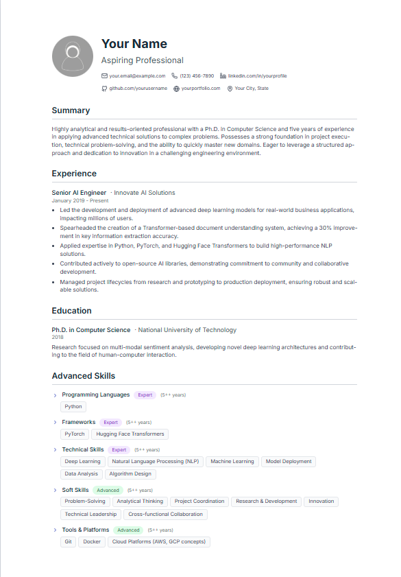
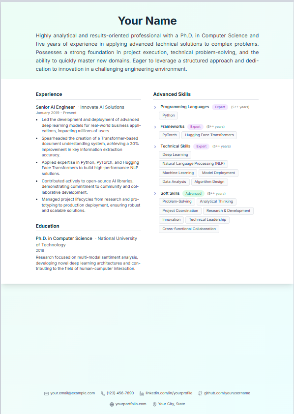
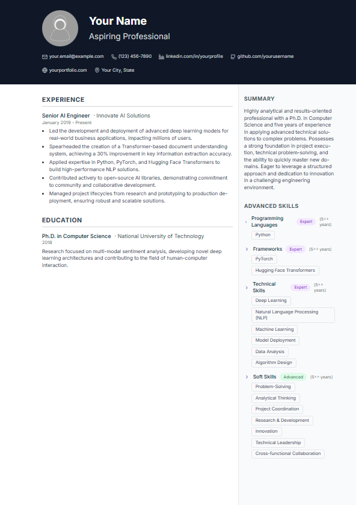
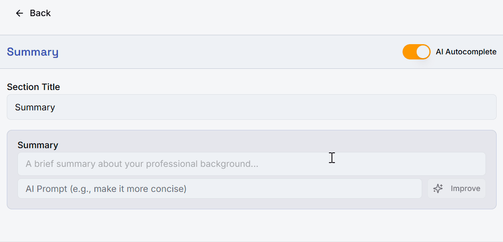

# Resume Studio

_中文说明 | [English](./README.md)_

一个由 AI 驱动的智能简历构建器，采用 Schema 驱动架构。支持创建、优化和自定义专业简历，拥有自动补全、内容改进和全面评审等先进的 AI 辅助功能。

**🛡️ 隐私优先设计**: Resume Studio 以隐私为核心原则构建。您的数据通过本地存储保留在您的设备上，您可以完全控制自己的信息。

<p align="center">
   
</p>

## ✨ 核心功能

### 🤖 AI 驱动的内容生成

- **一键生成简历**：根据职位描述或个人背景生成完整简历
- **求职信生成**：创建与简历和目标职位匹配的定制求职信
- **智能自动补全**：输入时提供实时内容建议
- **单字段内容优化**：AI 驱动的单个内容部分优化
- **批量内容提升**：多个部分的同时改进，支持差异对比视图
- **全面 AI 评审**：完整的简历分析与可执行的改进建议
- **🚀 即将推出**：对话式智能助手自动完成简历

### 🎨 专业模板

Resume Studio 包含多个专业设计的模板：

| 模板                   | 预览                                                                                      | 描述                             |
| ---------------------- | ----------------------------------------------------------------------------------------- | -------------------------------- |
| **经典专业版**         |                | 传统单列布局                     |
| **专业经典版（双列）** |        | 专业双列设计                     |
| **蓝宝石侧边栏**       |      | 优雅的深色侧边栏布局             |
| **翠绿侧边栏**         |      | 经典设计配茶绿色侧边栏和衬线字体 |
| **现代简约版**         |          | 简洁现代的样式                   |
| **创意双列版**         |      | 创新设计，视觉层次感强           |
| **连续叙述版**         |  | 杂志风格的连续流动布局           |
| **并行模块版**         |        | 功能独立的并行列布局             |

### 🏗️ Schema 驱动架构

基于**单一数据源**的 Schema 系统构建，实现：

- 动态章节创建和管理
- 一致的 AI 上下文构建
- 可扩展的数据结构
- 类型安全的开发

### 🛡️ 隐私与数据控制

- **本地存储**：所有数据都保留在您的设备上
- **无数据收集**：我们不收集或存储您的个人信息
- **开源透明**：完全透明的可审计代码
- **自托管选项**：部署您自己的实例以获得最大控制权

## 🚀 快速开始

### 前置要求

- Node.js 18+
- pnpm
- Google AI Studio API 密钥（Gemini）

### 安装步骤

1. **克隆仓库**

   ```bash
   git clone https://github.com/superGekFordJ/Resume-studio.git
   cd Resume-studio
   ```

2. **安装依赖**

   ```bash
   # 使用 pnpm 作为包管理器
   pnpm install
   ```

3. **配置环境变量**

   ```bash
   cp .env.example .env.local
   ```

   编辑 `.env.local` 并添加您的 Google AI Studio API 密钥：

   ```env
   GEMINI_API_KEY=your_api_key_here
   ```

   从 [Google AI Studio](https://aistudio.google.com/) 获取您的 API 密钥

   > [!IMPORTANT]
   > **重要配置说明**:
   >
   > - API 密钥**必须**通过环境文件配置（`.env.local` 或 `.env.production`）
   > - 由于 Genkit 生命周期限制，基于 UI 的 API 密钥配置暂时禁用
   > - 当前仅使用**预配置的 Gemini 模型** - 无法选择模型
   > - AI 系统重构后将支持多供应商和灵活的模型选择(您可以通过克隆 feature/ai-provider-backup 分支来尝试)

4. **启动开发服务器**

   ```bash
   pnpm dev
   ```

5. **打开浏览器**
   访问 `http://localhost:9002` 开始构建您的简历！

### 🎯 优化 AI 性能

为了获得最佳的 AI 辅助体验，我们**强烈建议**首先配置以下设置：

1. **目标职位信息**：进入设置 → 上传职位描述图片或粘贴职位详情。我们的 AI 将解析要求，提供高度针对性的建议。

2. **专业背景**：在设置中添加您的专业背景。系统将帮助您格式化内容，同时保护敏感凭证信息以保护隐私。

> [!NOTE]
> **为什么这很重要**：所有 AI 功能（自动补全、改进、评审、生成）都会接收这些上下文，以提供个性化、相关的建议，量身定制符合您的职业目标。

### 🔒 隐私建议

为了在使用 AI 功能时确保最大的数据隐私：

1. **启用 Google AI Studio 计费**：为了获得 Google AI 服务增强的数据隐私权，请在您的 [Google AI Studio 账户](https://aistudio.google.com/)中启用计费功能。这确保您的数据按照 Google 对付费客户的增强隐私政策处理。

2. **查看数据政策**：在使用 AI 功能之前，请阅读 Google AI 的隐私政策，了解您的数据如何被处理。

3. **自托管选项**：对于需要最大数据控制的组织，考虑在您自己的基础设施上自托管此应用程序。

### 功能演示

查看这些演示文件，了解 Resume Studio 的实际效果：

- 📹 **快速开始演示**：[demo/quick-start-of-generating-new-resumes.mp4](./demo/quick-start-of-generating-new-resumes.mp4)
- 🎯 **自动补全功能**：
- 📊 **批量改进功能**：

## 🔧 扩展 Resume Studio

### 添加新的简历章节

Resume Studio 的 Schema 驱动架构让添加新章节变得极其简单：

1. **定义您的 Schema** 在 `src/lib/schemas/defaultSchemas.ts` 中
2. **添加章节** 遵循现有的 Schema 格式
3. **注册上下文构建器** 以支持 AI 功能
4. **完成！** 您的新章节将自动支持所有 AI 功能

系统将自动处理：

- ✅ 表单字段生成
- ✅ AI 上下文构建
- ✅ 自动补全
- ✅ 内容改进
- ✅ 数据验证

### 创建新模板

想要添加自定义简历模板？比您想象的要简单：

1. **使用我们的模板指南**：将 `docs/ui/how-to-replicate-a-new-template.md` 分享给任何 LLM 助手
2. **参考现有示例**：查看 `src/components/resume/templates/` 中的现有模板
3. **提交 PR**：我们欢迎高质量的模板贡献！

我们的混合渲染模型确保您的模板在保持独特样式的同时，能够利用现有的原子组件。

## 📚 文档说明

> **注意**：文档目前为中文版本，这是为了在开发过程中优化 token 使用。

- 📖 **架构指南**：[docs/architecture.md](./docs/architecture.md)
- 🎨 **模板创建**：[docs/ui/how-to-replicate-a-new-template.md](./docs/ui/how-to-replicate-a-new-template.md)
- 🤖 **AI 集成**：[docs/ai/](./docs/ai/)
- 🏗️ **组件 API**：[docs/component-api-reference.md](./docs/component-api-reference.md)

## ⚠️ 当前限制

### AI 供应商支持

目前**仅支持 Google Gemini**，通过环境变量配置：

- ✅ **支持**：通过 `.env.local` 或 `.env.production` 配置 Gemini 预配置模型
- 🚧 **即将推出**：AI 系统重构后的全面多供应商支持（OpenAI、Anthropic、Ollama 等）
- ❌ **暂不可用**：基于 UI 的 API 密钥配置或模型选择（由于 Genkit 生命周期限制暂时禁用）
- ❌ **暂不可用**：自定义模型参数或微调选项

我们正在积极进行全面的 AI 系统重构，将支持多个供应商、灵活的配置选项和模型选择。

## 🛠️ 技术栈

- **前端**：Next.js 15, React 18, TypeScript
- **UI**：Tailwind CSS, Radix UI, shadcn/ui
- **AI**：Google Genkit, Gemini API
- **状态管理**：Zustand 持久化
- **样式**：CSS 变量，响应式设计

## 🤝 参与贡献

我们欢迎贡献！无论是：

- 🐛 错误修复
- ✨ 新功能
- 🎨 新模板
- 📝 文档改进
- 🌍 翻译

请随时提出 issue 和提交 pull request。

## 📄 许可证

本项目采用**非商用许可证**。

- ✅ **个人、教育和非商业用途免费**
- ❌ **商业用途需要明确许可**
- 📧 **商业许可请联系**：[hi@fordj.me](mailto:hi@fordj.me)

详情请查看 [LICENSE](LICENSE) 文件。

## 🙏 致谢

- 使用 [Google Genkit](https://firebase.google.com/docs/genkit) 构建 AI 集成
- UI 组件基于 [shadcn/ui](https://ui.shadcn.com/)
- 图标来自 [Lucide React](https://lucide.dev/)

---

**准备好构建您的完美简历了吗？** [现在开始！](#-快速开始)
